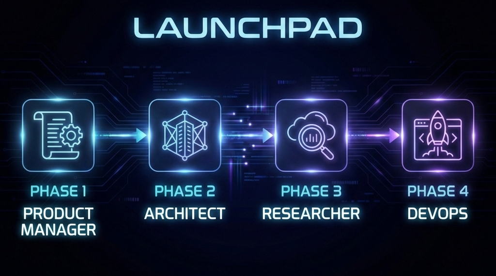

**A 4-phase workflow that transforms vague ideas into hallucination-proof codebases.**

> Stop the AI from inventing requirements, picking random libraries, and creating inconsistent structures. Launchpad forces deliberate planning before a single line of code is written.

---

## What is Launchpad?

Launchpad is a set of AI prompts that guide you through a structured project initialization process. Instead of asking an AI to "build me an app" and hoping for the best, you walk through four deliberate phases:

| Phase | You Act As | You Create | What Happens |
|:-----:|:----------:|:----------:|:-------------|
| **1** | Product Manager | `PRD.md` | Ambiguity → Specifications |
| **2** | Architect | `ARCH.md` | Specifications → Constraints |
| **3** | Researcher | `RESEARCH.md` | Constraints → Proven Patterns |
| **4** | DevOps | `setup.py` | Patterns → Working Scaffold |

**The result:** A project that's architected before it's built, with documentation that keeps both you and the AI aligned throughout development.

---

## Quick Start

### Prerequisites
- Access to Claude, ChatGPT, or another capable LLM
- A project idea
- A code editor

### The Workflow

1. **Clone or bookmark this repo**
2. **Phase 1:** Copy [phase1.md](phase1.md) → Paste into AI chat → Describe your idea → Save output as `docs/PRD.md`
3. **Phase 2:** Copy [phase2.md](phase2.md) + your PRD → Paste into AI → Save output as `docs/ARCH.md`
4. **Phase 3:** Copy [phase3.md](phase3.md) + PRD + ARCH → Paste into AI → Save output as `docs/RESEARCH.md`
5. **Phase 4:** Copy [phase4.md](phase4.md) + all docs → Get `setup_launchpad.py` → Run it

**That's it.** You now have a fully scaffolded project with clear documentation.

---

## The Four Phases

<details>
<summary><strong>Phase 1: Define WHAT You're Building</strong></summary>

**Prompt:** [phase1.md](phase1.md)

The AI becomes your Product Manager. It asks clarifying questions, then generates a complete Product Requirements Document with:
- User stories with acceptance criteria
- Functional requirements
- Explicit non-goals (scope boundaries)
- Success metrics

**Output:** `docs/PRD.md`
</details>

<details>
<summary><strong>Phase 2: Define HOW You'll Structure It</strong></summary>

**Prompt:** [phase2.md](phase2.md)

The AI becomes your Systems Architect. Based on your PRD, it asks about deployment, databases, and tech preferences, then generates:
- Tech stack with version constraints
- Domain dictionary (prevents conceptual drift)
- Data models and API contracts
- Directory structure

**Output:** `docs/ARCH.md`
</details>

<details>
<summary><strong>Phase 3: Find WHO Has Done It Before</strong></summary>

**Prompt:** [phase3.md](phase3.md)

The AI becomes your Research Analyst. It searches for similar open-source projects and extracts:
- Proven implementation patterns to adopt
- Anti-patterns to avoid
- Libraries worth considering
- Code snippets with attribution

**Output:** `docs/RESEARCH.md`
</details>

<details>
<summary><strong>Phase 4: Create the Project Scaffold</strong></summary>

**Prompt:** [phase4.md](phase4.md)

The AI becomes your DevOps Engineer. It generates a Python script that creates your entire project structure:
- Directory tree matching your ARCH.md
- Configuration files (.env, .gitignore, requirements.txt)
- `AGENTS.md` — the AI instruction kernel
- First development directive

**Output:** `setup_launchpad.py` → Run it to scaffold your project
</details>

---

## After Launchpad

Once scaffolded, your project includes `AGENTS.md` — a file that tells AI assistants how to work on your codebase. The development loop becomes:

```
Read AGENTS.md → Check directives/ → Write tests → Implement → Repeat
```

Every AI session starts grounded in your architecture, not improvising from scratch.

---

## Project Structure After Setup

```
your-project/
├── AGENTS.md              # AI reads this first, every session
├── docs/
│   ├── PRD.md             # What we're building
│   ├── ARCH.md            # How it's structured
│   └── RESEARCH.md        # Patterns we're following
├── directives/            # Task assignments for the AI
├── src/                   # Your code
├── tests/                 # Tests (written first!)
└── execution/             # Automation scripts
```

---

## Tips

| Tip | Why |
|-----|-----|
| Be specific in Phase 1 | Fewer clarifying questions, better PRD |
| Don't skip Phase 2 questions | Architecture decisions have long-term consequences |
| Phase 3 is for patterns, not features | Stay focused on implementation, not scope creep |
| Trust the constraints | Once ARCH.md is set, resist the urge to deviate |

---

## Troubleshooting

<details>
<summary>"The AI ignored my ARCH.md"</summary>

Start a fresh conversation and explicitly paste all docs. Say "use ONLY the stack in ARCH.md."
</details>

<details>
<summary>"The PRD is too vague"</summary>

Go back to Phase 1. Answer questions more specifically. Add concrete workflow examples.
</details>

<details>
<summary>"Phase 3 found irrelevant repos"</summary>

Be more specific about domain terms in your ARCH.md Dictionary section.
</details>

---

## Contributing

PRs welcome! Especially valuable:
- Framework-specific variants (Rails, Laravel, etc.)
- Additional phases (discovery, deployment)
- Non-English translations

---

## License

MIT — Use freely, modify as needed, no attribution required.
