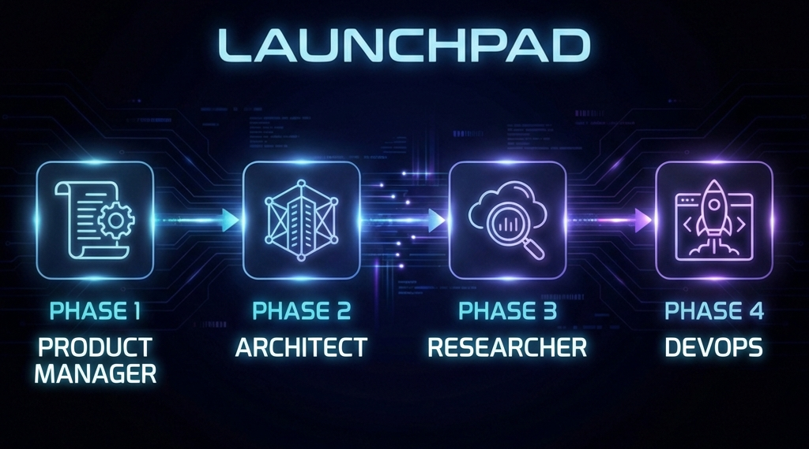

**A 4-phase workflow that transforms vague ideas into hallucination-proof codebases with built-in execution methodology.**

> Stop the AI from inventing requirements, picking random libraries, and creating inconsistent structures. Launchpad forces deliberate planning before a single line of code is written — then enforces rigorous development practices throughout implementation.

---

## What is Launchpad?

Launchpad is a set of AI prompts that guide you through a structured project initialization process. Instead of asking an AI to "build me an app" and hoping for the best, you walk through four deliberate phases:

| Phase | You Act As | You Create | What Happens |
|:-----:|:----------:|:----------:|:-------------|
| **1** | Product Manager | `PRD.md` | Ambiguity → Specifications |
| **2** | Architect | `ARCH.md` | Specifications → Constraints |
| **3** | Researcher | `RESEARCH.md` | Constraints → Proven Patterns |
| **4** | DevOps | `setup.py` | Patterns → Working Scaffold + Execution Methodology |

**The result:** A project that's architected before it's built, with documentation that keeps both you and the AI aligned throughout development — plus a rigorous execution methodology that enforces TDD, review gates, and verification at every step.

---

## Quick Start

### Prerequisites
- Access to Claude, ChatGPT, or another capable LLM
- A project idea
- A code editor

### Phase by Phase Approach

Four separate sessions, maximum control.

1. Clone or bookmark this repo
2. Phase 1: Copy [phase1.md](./phase1.md) → Paste into AI → Save output as `docs/PRD.md`
3. Phase 2: Copy [phase2.md](./phase2.md) + your PRD → Paste into AI → Save as `docs/ARCH.md`
4. Phase 3: Copy [phase3.md](./phase3.md) + PRD + ARCH → Paste into AI → Save as `docs/RESEARCH.md`
5. Phase 4: Copy [phase4.md](./phase4.md) + all docs → Get `setup_launchpad.py` → Run it
6. Initiate directives: Copy [directive.md](./directive.md) + your generated planning docs into AI → Generate the remaining files in `directives/`
   - Use this after the scaffold exists
   - This is not an official Launchpad phase
   - Its purpose is to create the implementation directive backlog that phases 1-4 do not produce on their own

Each phase runs in its own AI session. You manually pass outputs between phases. Best when you want to iterate heavily on individual phases or use different AI models per phase.

You end up with a fully scaffolded project, complete planning documents, and a sequenced directive backlog for implementation.
---

## The Four Phases

<details>
<summary><strong>Phase 1: Define WHAT You're Building</strong></summary>

**Prompt:** [phase1.md](phase1.md)

The AI becomes your Product Manager. It asks clarifying questions, then generates a complete Product Requirements Document with:
- User stories with acceptance criteria
- Functional requirements
- Explicit non-goals (scope boundaries)
- Success metrics

**Output:** `docs/PRD.md`
</details>

<details>
<summary><strong>Phase 2: Define HOW You'll Structure It</strong></summary>

**Prompt:** [phase2.md](phase2.md)

The AI becomes your Systems Architect. Based on your PRD, it asks about deployment, databases, and tech preferences, then generates:
- Tech stack with version constraints
- Domain dictionary (prevents conceptual drift)
- Data models and API contracts
- Directory structure

**Output:** `docs/ARCH.md`
</details>

<details>
<summary><strong>Phase 3: Find WHO Has Done It Before</strong></summary>

**Prompt:** [phase3.md](phase3.md)

The AI becomes your Research Analyst. It searches for similar open-source projects and extracts:
- Proven implementation patterns to adopt
- Anti-patterns to avoid
- Libraries worth considering
- Code snippets with attribution

**Output:** `docs/RESEARCH.md`
</details>

<details>
<summary><strong>Phase 4: Create the Project Scaffold + Execution Methodology</strong></summary>

**Prompt:** [phase4.md](phase4.md)

The AI becomes your DevOps Engineer. It generates a Python script that creates your entire project structure:
- Directory tree matching your ARCH.md
- Configuration files (.env, .gitignore, requirements.txt)
- `AGENTS.md` — the AI instruction kernel with built-in enforcement rules
- Methodology reference documents (implementation planning, review gates, debugging)
- First development directive

**What makes AGENTS.md special:** Beyond project context and conventions, it now includes:
- **TDD Iron Law** — mandatory test-first development with a rationalizations table that preemptively blocks common AI excuses for skipping tests
- **Implementation Planning** — forces granular task decomposition (2-5 min steps with exact file paths and complete code) before any coding begins
- **Review Gates** — two-stage review (spec compliance, then code quality) after every task, with batch checkpoints every 3 tasks
- **Verification Before Completion** — no "done" claims without running commands and reading actual output
- **Systematic Debugging** — 4-phase root cause analysis with a 3-strikes architectural escape hatch
- **Anti-Rationalization Rules** — preemptive rebuttals to the ways AI agents try to bypass process

**Output:** `setup_launchpad.py` → Run it to scaffold your project
</details>

---

## Initiate Directives

After you complete all four Launchpad phases and run the generated scaffold, use [directive.md](./directive.md) to create the implementation directive backlog.

This is **not** an official Launchpad phase. It is a follow-up prompt that fills a practical gap in the workflow: phases 1-4 produce the planning documents and scaffold, but they do not generate the full set of sequenced implementation directives needed for execution.

### When to use it

Use `directive.md` **after** you have:

- `docs/PRD.md`
- `docs/ARCH.md`
- `docs/RESEARCH.md`
- `AGENTS.md`
- the scaffolded project structure from `setup_launchpad.py`

### What it does

`directive.md` generates the remaining directive files in `directives/` so the AI has an ordered backlog of implementation work rather than just planning documents.

Typical result:

- `directives/001_initial_setup.md` already exists from scaffolding
- `directive.md` generates `directives/002_*.md` through `directives/NNN_*.md`

### How to run it

1. Finish phases 1-4
2. Run `setup_launchpad.py`
3. Copy [directive.md](./directive.md) into a fresh AI session
4. Provide your generated planning docs and scaffold context
5. Save the returned directive files into `directives/`

Once those directives exist, move into the normal development loop below.

## After Launchpad: The Development Workflow

Once scaffolded, your project includes `AGENTS.md` and methodology docs that define how AI assistants work on your codebase. The development loop becomes:

```
Read directive → Write implementation plan → Execute tasks via TDD → Review gates → Verify → Mark complete → Next directive
```

### Step by Step

1. **Read the directive** — Check `directives/` for the lowest-numbered incomplete task
2. **Write an implementation plan** — Break the directive into granular tasks (2-5 min each) following `docs/methodology/implementation-planning.md`. Save to `docs/plans/`
3. **Execute each task via TDD** — RED (failing test) → GREEN (minimum code) → REFACTOR → COMMIT
4. **Pass review gates** — After each task: spec compliance review, then code quality review
5. **Batch checkpoint** — Every 3 tasks, pause and report progress for human feedback
6. **Verify completion** — Run all tests, linters, type checks. Include evidence in your report
7. **Mark directive complete** — Update the directive status
8. **Repeat** — Move to the next directive

Every AI session starts grounded in your architecture and methodology, not improvising from scratch.

---

## Project Structure After Setup

```
your-project/
├── AGENTS.md              # AI reads this first, every session
├── docs/
│   ├── PRD.md             # What we're building
│   ├── ARCH.md            # How it's structured
│   ├── RESEARCH.md        # Patterns we're following
│   ├── plans/             # Implementation plans (created during development)
│   └── methodology/
│       ├── implementation-planning.md   # How to decompose tasks
│       ├── review-gates.md             # How to review completed work
│       └── debugging-guide.md          # How to debug systematically
├── directives/            # Task assignments for the AI
├── src/                   # Your code
├── tests/                 # Tests (written first!)
└── execution/             # Automation scripts
```

---

## Tips

| Tip | Why |
|-----|-----|
| Be specific in Phase 1 | Fewer clarifying questions, better PRD |
| Don't skip Phase 2 questions | Architecture decisions have long-term consequences |
| Phase 3 is for patterns, not features | Stay focused on implementation, not scope creep |
| Trust the constraints | Once ARCH.md is set, resist the urge to deviate |
| Follow TDD strictly | The rationalizations table exists because every excuse has been tried |
| Don't skip review gates | Small issues compound into architectural problems |
| Use implementation plans | 5 minutes of planning saves 30 minutes of debugging |

---

## Troubleshooting

<details>
<summary>"The AI ignored my ARCH.md"</summary>

Start a fresh conversation and explicitly paste all docs. Say "use ONLY the stack in ARCH.md."
</details>

<details>
<summary>"The PRD is too vague"</summary>

Go back to Phase 1. Answer questions more specifically. Add concrete workflow examples.
</details>

<details>
<summary>"Phase 3 found irrelevant repos"</summary>

Be more specific about domain terms in your ARCH.md Dictionary section.
</details>

<details>
<summary>"The AI keeps skipping tests"</summary>

Point it to AGENTS.md Section 3 (TDD Iron Law) and the rationalizations table. Start a fresh session if needed — context drift causes test-skipping.
</details>

<details>
<summary>"The AI claims it's done but things are broken"</summary>

Point it to AGENTS.md Section 6 (Verification Before Completion). Require it to paste actual command output before accepting any "done" claim.
</details>

---

## Acknowledgments

The execution methodology in Phase 4 (TDD enforcement, review gates, anti-rationalization rules, systematic debugging, verification-before-completion) is inspired by [Superpowers](https://github.com/obra/superpowers) by Jesse Vincent. Launchpad adapts these patterns into its scaffolding output so users get a rigorous development process out of the box.

---

## Contributing

PRs welcome! Especially valuable:
- Framework-specific variants (Rails, Laravel, etc.)
- Additional phases (discovery, deployment)
- Non-English translations
- Improvements to the execution methodology

---

## License

MIT — Use freely, modify as needed, no attribution required.
